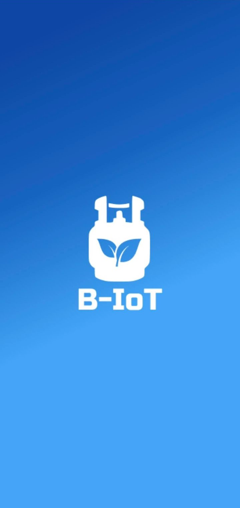
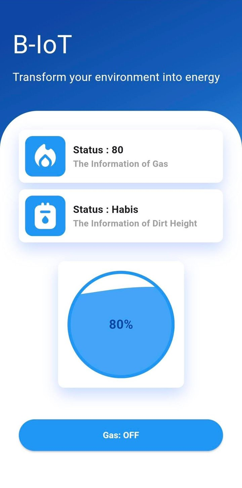

# B-IoT Innovillage 2023 Competition

Welcome to the official repository for our submission to the **Innovillage 2023 Competition**. This project was developed to support smart village initiatives by integrating Internet of Things (IoT) technologies with real-time environmental monitoring and control systems.

## 🌐 Project Overview

This project demonstrates a complete IoT solution focused on:

* **Smart monitoring** of environmental parameters
* **Real-time data acquisition and control** via embedded systems
* **User interface** built with Flutter for remote data viewing and device control
* **Embedded firmware** written in C++ for microcontroller operation

## 📁 Folder Structure

```
├── img/                  # Images and visual assets
├── lib/                  # Flutter libraries and UI code
├── src/                  # Embedded C++ code for hardware control
├── platformio.ini        # PlatformIO configuration for embedded project
```

## 🛠 Technologies Used

* **Flutter (Dart)** – Mobile application frontend
* **C++ (PlatformIO)** – Firmware for ESP32 or similar microcontrollers
* **HTTP Protocol** – Real-time communication using Firebase Realtime Database
* **Sensors** – Various environmental sensors such as temperature, humidity, and gas

## 🚀 Getting Started

### Requirements

* Flutter SDK
* PlatformIO (VS Code extension)
* ESP32 or compatible microcontroller board

### Setup Instructions

1. Clone this repository:

   ```bash
   git clone https://github.com/ndriuu/b-iot-innovillage2023-competition.git
   ```
2. Open the `src/` folder with VS Code and ensure PlatformIO is configured.
3. Flash firmware to ESP32 using PlatformIO.
4. Open the `lib/` folder in your Flutter environment to run the mobile UI.

## 📱 UI/UX Showcase

Include screenshots of the mobile application below:



## 📜 License

This project is licensed under the MIT License. See `LICENSE` for more information.

## 👥 Team

Developed by Aruna and team for Innovillage 2023.

---
